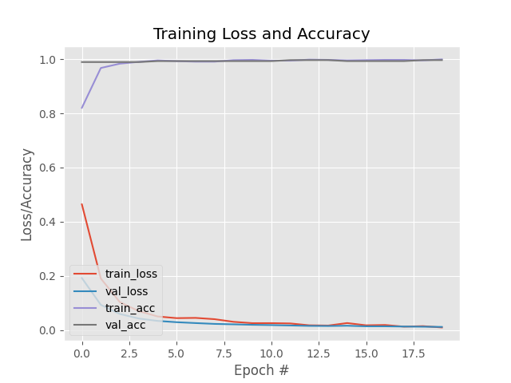

# COVID 19 Face Mask Detector 
This project was made for the course Soft Computing WIX2001 Semester 2 Year 2021/2022

## Pre-Requisites Before running
* Install Tensorflow using `pip install tensorflow`.
* Install OpenCV using `pip install opencv-python` and `pip install opencv-contrib-python`.
* Install Keras using `pip install keras`.
* Install Numpy using `pip install numpy`.

### Dataset Contents
The dataset consists of 1376 images belonging to the following two classes:
* with_mask: 690 images
* without_mask: 686 images

### Training the Model
The model can be trained using the train_mask_detector.py script using the following command

    python train_mask_detector.py --dataset dataset
    
### Accuracy and Loss Curves

## Inference
Inference can be performed by using the inference.py script using the following command.
    
    python inference.py
    
## Possible Error
The model was trained using images of white and blu color masks. Masks with other colors may be not recognized correctly by the model.
